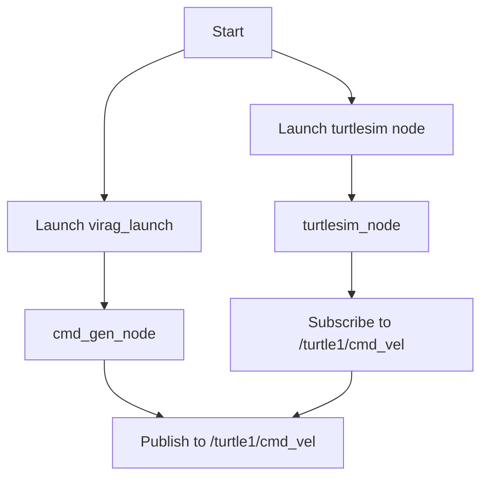

# `fen_ber` package
ROS 2 python package.  [](https://docs.ros.org/en/humble/)
## Packages and build

It is assumed that the workspace is `~/ros2_ws/`.

### Clone the packages
``` r
cd ~/ros2_ws/src
```
``` r
git clone https://github.com/csaneszvk/fen_ber
```

### Build ROS 2 packages
``` r
cd ~/ros2_ws
```
``` r
colcon build --packages-select fen_ber --symlink-install
```

Source the program
``` bash
source ~/ros2_ws/install/setup.bash
```

Launch the program
``` r
ros2 launch fen_ber ' virag_launch.py' (Kellenek az idézőjelek és a virag elötti space is!)
```
Now `colcon build` your ROS 2 package and you can start wokring.
