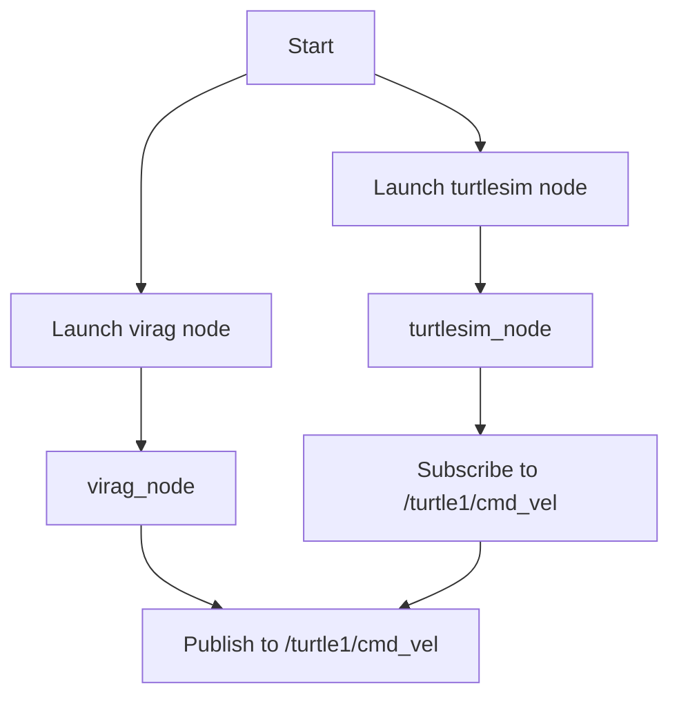

# `fen_ber` package
ROS 2 python package.  [](https://docs.ros.org/en/humble/)
## Packages and build

It is assumed that the workspace is `~/ros2_ws/`.

### Clone the packages
``` r
cd ~/ros2_ws/src
```
``` r
git clone https://github.com/csaneszvk/fen_ber
```

### Build ROS 2 packages
``` r
cd ~/ros2_ws
```
``` r
colcon build --packages-select fen_ber --symlink-install
```

<details>
<summary> Don't forget to source before ROS commands.</summary>

``` bash
source ~/ros2_ws/install/setup.bash
```
</details>

``` r
ros2 launch fen_ber virag_launch.py
```

<p align="center"></p>


Let's assume 
- your Github username is `mycoolusername`
- your ROS 2 repo shold be `cool_ros2_package`

Replace everything in the cloned repo:

- `fen_ber` >> `cool_ros2_package` (the folder was already renamed after `Use this template`)
- `csaneszvk` >> `mycoolusername`
- find all `todo` strings and fill the blanks

The easiest way is VS code:

<p align="center"></p>

> [!IMPORTANT]  
> Don't forget to rename the directory (folder) and the file too.

Now `colcon build` your ROS 2 package and you can start wokring.
